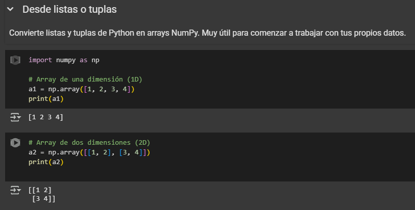
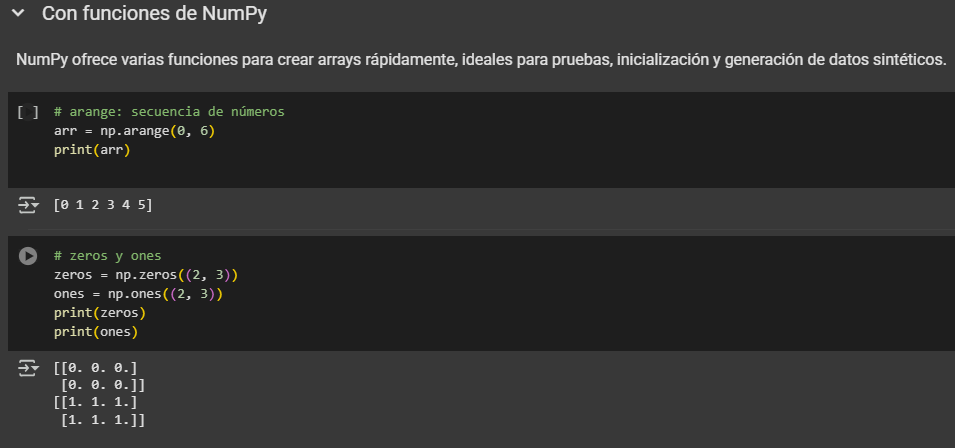
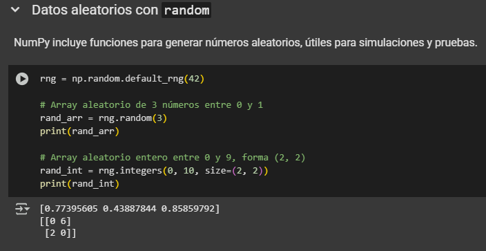
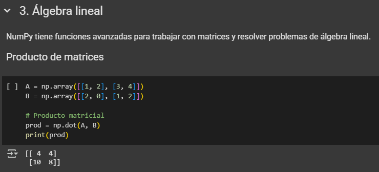
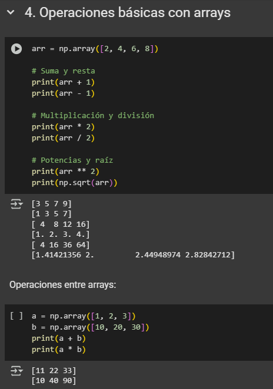

# NumPy – Creación y Manipulación de Arreglos

## Introducción

NumPy es la biblioteca principal para trabajar con arrays en Python. Usar arrays (ndarrays) permite procesar datos de forma eficiente y realizar cálculos matemáticos rápidamente, algo fundamental en ciencia de datos y análisis numérico.

A continuación explico cómo crear arrays, cambiarlos de forma (reshape), concatenarlos y realizar operaciones básicas, con ejemplos probados en Google Colab. En cada sección agrego una breve idea de para qué sirve cada operación.

---

## 1. Creación de arrays

> **¿Para qué sirve?**  
> Los arrays son la base para procesar datos en NumPy. Puedes crearlos a partir de listas, tuplas o usando funciones de la propia librería para generar datos automáticamente.

### Desde listas o tuplas

Convierte listas y tuplas de Python en arrays NumPy. Muy útil para comenzar a trabajar con tus propios datos.

```python
import numpy as np

# Array de una dimensión (1D)
a1 = np.array([1, 2, 3, 4])
print(a1)
# Resultado: [1 2 3 4]

# Array de dos dimensiones (2D)
a2 = np.array([[1, 2], [3, 4]])
print(a2)
# Resultado:
# [[1 2]
#  [3 4]]
```


### Con funciones de NumPy

NumPy ofrece varias funciones para crear arrays rápidamente, ideales para pruebas, inicialización y generación de datos sintéticos.

```python
# arange: secuencia de números
arr = np.arange(0, 6)
print(arr)
# Resultado: [0 1 2 3 4 5]

# zeros y ones
zeros = np.zeros((2, 3))
ones = np.ones((2, 3))
print(zeros)
print(ones)
# Resultado:
# [[0. 0. 0.]
#  [0. 0. 0.]]
# [[1. 1. 1.]
#  [1. 1. 1.]]
```


---

## 2. Cambiar la forma de un array (reshape)

> **¿Para qué sirve?**  
> Muchas veces necesitas reorganizar tus datos para adaptarlos a modelos, gráficos o análisis. Con `reshape` puedes cambiar la estructura del array sin perder la información.

```python
arr = np.arange(6)
reshaped = arr.reshape((2, 3))
print(reshaped)
# Resultado:
# [[0 1 2]
#  [3 4 5]]
```


---

## 3. Concatenar arrays

> **¿Para qué sirve?**  
> Unir arrays te permite agrupar información, combinar resultados o construir estructuras más grandes a partir de datos pequeños.

Unir arrays puede hacerse horizontal o verticalmente.

```python
a = np.array([[1, 2], [3, 4]])
b = np.array([[5, 6]])

# Vertical (añadir filas)
v_concat = np.vstack((a, b))
print(v_concat)
# Resultado:
# [[1 2]
#  [3 4]
#  [5 6]]

# Horizontal (añadir columnas)
c = np.array([[7], [8], [9]])
h_concat = np.hstack((v_concat, c))
print(h_concat)
# Resultado:
# [[1 2 7]
#  [3 4 8]
#  [5 6 9]]
```
Para arrays 1D, se puede usar `concatenate`:

```python
x = np.array([1, 2, 3])
y = np.array([4, 5, 6])
xy = np.concatenate([x, y])
print(xy)
# Resultado: [1 2 3 4 5 6]
```

---

## 4. Operaciones básicas con arrays

> **¿Para qué sirve?**  
> Las operaciones matemáticas sobre arrays son esenciales para análisis, procesamiento de señales, estadística y cualquier cálculo sobre datos. NumPy permite operar sobre todos los elementos sin necesidad de escribir bucles.

Las operaciones matemáticas se aplican a todos los elementos. No es necesario recorrer el array con for.

```python
arr = np.array([2, 4, 6, 8])

# Suma y resta
print(arr + 1)      # [3 5 7 9]
print(arr - 1)      # [1 3 5 7]

# Multiplicación y división
print(arr * 2)      # [ 4  8 12 16]
print(arr / 2)      # [1. 2. 3. 4.]

# Potencias y raíz
print(arr ** 2)     # [ 4 16 36 64]
print(np.sqrt(arr)) # [1.41421356 2.         2.44948974 2.82842712]
```

Operaciones entre arrays:

```python
a = np.array([1, 2, 3])
b = np.array([10, 20, 30])
print(a + b)        # [11 22 33]
print(a * b)        # [10 40 90]
```

---

## Fuentes

- Array creation — NumPy v2.3 manual. (s/f). Numpy.org. Recuperado el 26 de agosto de 2025, de https://numpy.org/doc/stable/user/basics.creation.html
- Google colab. (s/f). Google.com. Recuperado el 26 de agosto de 2025, de https://colab.research.google.com/drive/1y9wOg9nnFlTXrY3lGtamlAhoPrmmGye0?authuser=1 [Ejecuciones propias en Google Colab] 
- Sherrill, D. [@CodeWithDerrick]. (s/f). Introduction to NumPy arrays for beginners - learn NumPy series [[Object Object]]. Youtube. Recuperado el 26 de agosto de 2025, de https://www.youtube.com/watch?v=9fcTq8PDWWA

